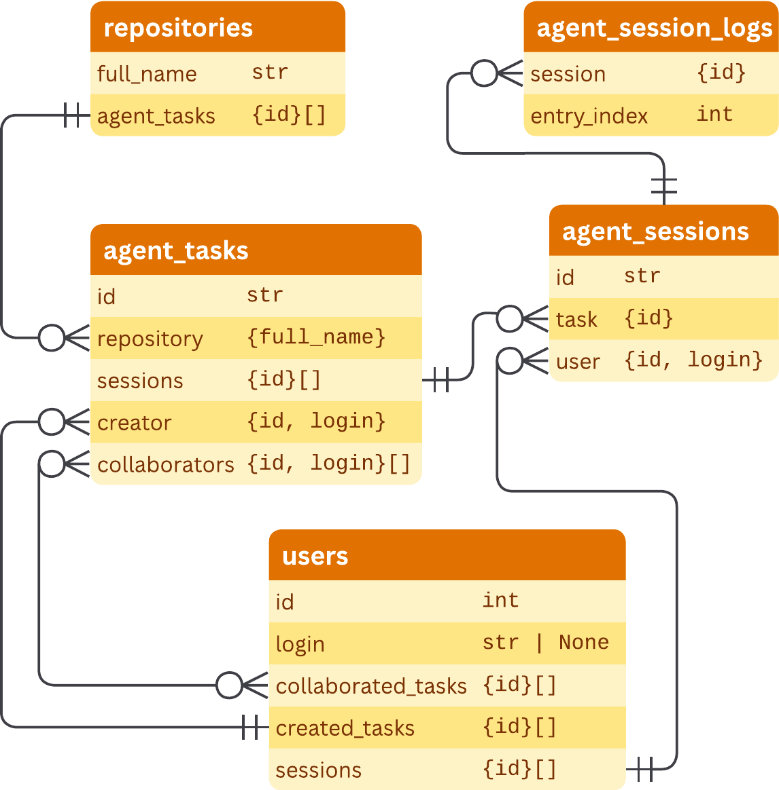

# AgentLogs

<a href="https://github.com/risenlab/agentlogs/tree/main" target="_blank" rel="noopener noreferrer"></a>
<a href="https://pypi.org/project/risenlab-agentlogs/" target="_blank" rel="noopener noreferrer"></a>
<a href="https://huggingface.co/datasets/risenlab/agentlogs" target="_blank" rel="noopener noreferrer"></a>
<a href="https://arxiv.org/abs/2608.29204" target="_blank" rel="noopener noreferrer"></a>

AgentLogs is a dataset of activity related to the [GitHub agents functionality](https://github.com/features/copilot/agents): repository metadata, agent tasks, sessions, session logs (messages, tool calls, usage details, etc.), and user records. This repository contains schema definitions, example analysis notebooks, and a sample of the dataset.

This dataset is described in:

> Jonan Richards, Kosei Horikawa, Youmei Fan, Yutaro Kashiwa, and Mairieli Wessel (2026), *AgentLogs: A Dataset for Opening the Black Box of GitHub's Cloud Agent*. arXiv: [2608.29204](https://arxiv.org/abs/2608.29204) (preprint).

## Dataset

The AgentLogs dataset contains the following tables:

| | # Records | Size | Table | Content |
| --- | ---: | ---: | --- | --- |
| **Repositories**<br><small>−&nbsp;1.98% with agent tasks</small> | 1,812,362<br><small>-&nbsp;35,810</small> | 395.6&nbsp;MB | [`repositories`](docs/schema/repository.md) | Public GitHub repositories with over 10 stars (metadata including name, license, language, stars, forks, timestamps, labels, topics). |
| **Agent tasks**<br><small>−&nbsp;99.90% found</small><br><small>−&nbsp;97.00% with sessions</small> | 307,416<br><small>-&nbsp;307,108</small><br><small>-&nbsp;298,188</small> | 77.1&nbsp;MB | [`agent_tasks`](docs/schema/agent_task.md) | Agent assignment on a repository (metadata including name, request, state, creator, timestamps, branch/PR identifiers). |
| **Agent sessions** | 549,239 | 225.1&nbsp;MB | [`agent_sessions`](docs/schema/agent_session.md) | Agent runs within a task (metadata including model, prompt, outcome, usage, and branch/PR identifier for that session). |
| **Log entries**<br><small>−&nbsp;>99.99% parsed</small> | 64,255,174<br><small>-&nbsp;64,254,936</small> | 56.0&nbsp;GB | [`agent_session_logs`](docs/schema/agent_session_log_entry.md) | Session log events (including messages, usage details, tool calls for file edits, git, and GitHub issues, PRs, comments, CI). |
| **Users**<br><small>−&nbsp;99.96% found</small> | 33,573<br><small>-&nbsp;33,561</small> | 39.7&nbsp;MB | [`users`](docs/schema/user.md) | Users related to the agent tasks and sessions (only GitHub id and username). |
| **Total** | **66,957,764** | **56.7&nbsp;GB** | | |

See the [schema reference](docs/schema/README.md) for field-level documentation of each table.

<p align="center">
  
  <br>
  <em>Entity relationship diagram for the AgentLogs dataset. Non-foreign key fields are omitted.</em>
</p>

The full dataset is published on [Hugging Face](https://huggingface.co/datasets/risenlab/agentlogs). This repository includes a **sample** of this data under `data/dataset-sample/` (see [`DATA_LICENSE`](DATA_LICENSE)). Repository records in the sample (and in the full dataset) contain data from the [GitHub Search](https://seart-ghs.si.usi.ch/) list (see [License](#license)).

## This repository

| Path | Description |
| --- | --- |
| [`packages/risenlab-agentlogs/`](packages/risenlab-agentlogs/) | TypedDict schema definitions |
| [`scripts/analysis/`](scripts/analysis/) | Example notebooks for analyzing the dataset |
| [`data/dataset-sample/`](data/dataset-sample/) | Sample of the dataset for demonstration purposes |
| [`docs/figures/`](docs/figures/) | Entity relationship diagram |
| [`LICENSE`](LICENSE) | MIT license for code in this repository |
| [`DATA_LICENSE`](DATA_LICENSE) | CC BY 4.0 license for the AgentLogs dataset (includes GHS MIT notice) |

## Setup

```bash
python -m venv .venv
source .venv/bin/activate
pip install risenlab-agentlogs
# or from this repository: pip install -e packages/risenlab-agentlogs
```

Import types in your own code:

```python
from agentlogs.schema import AgentSessionLogEntry, Repository, AgentTask, ...
```

## Analysis examples

The notebooks in [`scripts/analysis/`](scripts/analysis/) show different ways to work with the dataset. DuckDB, Polars, and local streaming read parquet from disk: use the bundled sample under `data/dataset-sample/`, or download a Hub snapshot into `data/dataset/`. The Hugging Face streaming notebook reads from the Hub without a local copy and is not meant for the sample. Which approach to take depends on the kind of analysis you are doing and what tools you are familiar with.

### [`examples_duckdb.ipynb`](scripts/analysis/examples_duckdb.ipynb): DuckDB, SQL querying over Parquet

Query the dataset with SQL similar to a database. DuckDB can read Parquet directly from disk, so you can aggregate without loading the entire dataset into memory.

**Good for:**

- Accessing the dataset using SQL (`COUNT`, `GROUP BY`, joins across tables).
- Exploring the dataset quickly.
- Computing summary statistics over full tables.

**Not ideal for:**

- Writing a reusable Python analysis pipeline instead of single-use queries (see Polars).
- Complex logic on individual rows with IDE autocompletion (see streaming).

### [`examples_polars.ipynb`](scripts/analysis/examples_polars.ipynb): Polars, lazy-loaded DataFrames

Load and transform the data using Polars, a DataFrame library similar to pandas. However, it can handle datasets larger than the available memory by scanning files lazily.

**Good for:**

- Building multi-step pipelines within Python.
- Balancing memory usage and time to run.
- Aggregating over nested fields.

**Not ideal for:**

- Analysis that can be written as a single query instead of a pipeline (see DuckDB).
- Complex logic on individual rows with IDE autocompletion (see streaming).

### [`examples_streaming.ipynb`](scripts/analysis/examples_streaming.ipynb): Streaming, iterating row-by-row with type support

Read local Parquet tables in small batches and iterate over individual records. Each record is typed, so you get autocomplete and type checking (also for nested fields)!

**Good for:**

- Inspecting individual records and nested fields.
- Running custom Python logic per row (e.g. regex parsing, sequence analysis).
- Low memory usage, by processing one batch at a time.

**Not ideal for:**

- Computing counts or distributions over the full dataset and/or for single columns (see DuckDB and Polars).

### [`examples_streaming_huggingface.ipynb`](scripts/analysis/examples_streaming_huggingface.ipynb): Hugging Face `load_dataset`, streaming from the Hub

Same row-by-row pattern as the local streaming notebook for the smaller tables, but `load_dataset(..., streaming=True)` reads parquet from Hugging Face without filling `data/dataset/`. Do not stream `agent_session_logs` from the Hub (full rows, including payloads, are downloaded to your machine). Use [`examples_streaming.ipynb`](scripts/analysis/examples_streaming.ipynb) with the sample or a snapshot.

**Good for:**

- Trying the published dataset without a local copy.
- The same per-row typed inspection as streaming.

**Not ideal for:**

- Repeated scans (bytes are fetched again each run; download parquet and use DuckDB, Polars, or local streaming).
- Aggregates over a full table (see DuckDB and Polars).

## Citation

If you use AgentLogs in an academic publication, please cite this preprint:

```bibtex
@misc{richards2026AgentLogsDatasetOpening,
  title = {{AgentLogs: A Dataset for Opening the Black Box of GitHub's Cloud Agent}},
  author = {Richards, Jonan and Horikawa, Kosei and Fan, Youmei and Kashiwa, Yutaro and Wessel, Mairieli},
  year = 2026,
  month = aug,
  eprint = {2608.29204},
  primaryclass = {cs.SE},
  doi = {10.48550/arXiv.2608.29204},
  archiveprefix = {arXiv},
  url = {https://arxiv.org/abs/2608.29204}
}
```

## License

This repository contains both **code** and **data**, under different licenses:

- **Code** (packages, scripts, notebooks): [MIT](LICENSE)
- **Dataset** (sample under `data/dataset-sample/` and the Hugging Face release): [CC BY 4.0](DATA_LICENSE)

Repository sampling for AgentLogs uses [GitHub Search](https://seart-ghs.si.usi.ch/)
([GitHub](https://github.com/seart-group/ghs), [Zenodo](https://doi.org/10.5281/zenodo.4588464))
&copy; SEART Research Group and Contributors, used under the
[MIT License](https://github.com/seart-group/ghs/blob/master/LICENSE).

The GitHub Search seed CSV is downloaded at collection time and is not distributed with this repository. The `repositories` table is built from that CSV.
